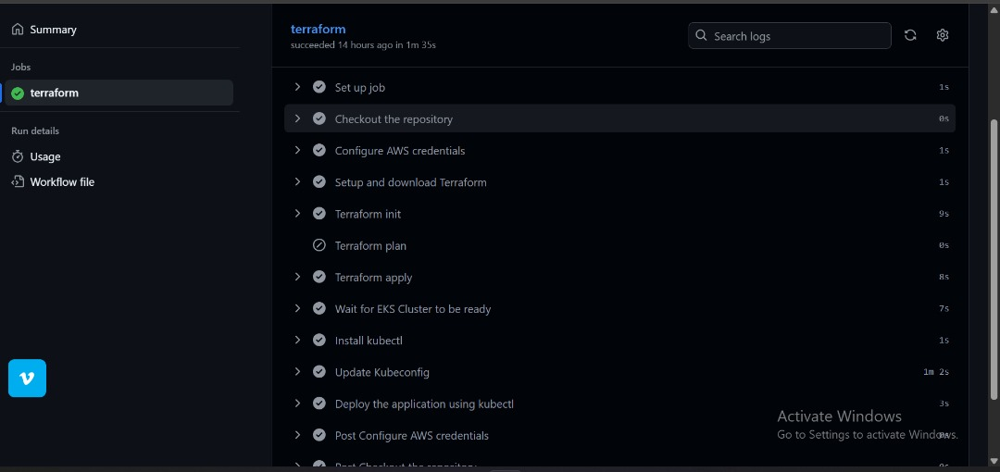

# InnovateMart EKS Deployment – Project Bedrock

**Student:** Ogbuinya Johnmark Chisom  
**AltSchool ID:** ALT/SOE/024/1754

---

## 📌 Overview
This project is my solution to the AltSchool Cloud Engineering Semester 3, Month 2 assessment.  
The goal was to deploy **InnovateMart’s Retail Store Application** to AWS **Elastic Kubernetes Service (EKS)** with automation, security, and scalability best practices.  

The implementation covers:  
- **Infrastructure as Code (IaC)** using Terraform  
- **Kubernetes deployment** of microservices  
- **CI/CD automation** with GitHub Actions  
- **IAM roles and developer access**  

---

## 🚀 Step 1: Provisioning Infrastructure with Terraform
1. Created a **VPC** and stored the variables in `terraform.tfvars` with all dependencies like route tables, subnets, and gateways attached.  
     
     
     

2. Provisioned **EKS cluster**:  
   - Cluster Name: `innovatemart-cluster`  
   - Kubernetes Version: `1.30`  
   - Node Group: `t3.small`  
   - Desired: 2, Min: 2, Max: 4  
     

3. Created **IAM roles & policies** for:  
   - EKS cluster  
   - Node group  
   - Read-only developer user  
     
     

---

## 🌐 Step 2: Deploying the Retail Store Application
- Applied the `kubernetes.yaml` file to deploy the microservices.  
- Retrieved the **LoadBalancer URL** with:  
  ```bash
  kubectl get svc
Copied the URL and confirmed the UI was accessible.


⚙️ Step 3: CI/CD Automation

Created a GitHub Actions workflow under .github/workflows to automate the Terraform process.

Defined steps for:

Initializing Terraform

Running terraform plan for feature branches

Running terraform apply for the main branch

Using GitHub Secrets to manage AWS credentials securely





🔑 Step 4: Developer Access & Manual Validation

Manually verified that everything was working correctly.

Logged in with the read-only IAM user created for the instructor to confirm:

Able to list pods, view logs, and check services ✅

Unable to make changes ❌

Verified node groups and access entries:


✅ Verification

EKS cluster successfully provisioned via Terraform.

Retail Store Application deployed and accessible via LoadBalancer URL.

CI/CD pipeline validated by GitHub Actions runs.

Read-only developer user tested and confirmed with limited access.

📖 Lessons Learned

How to provision EKS clusters and networking with Terraform.

Deploying microservices with Kubernetes manifests.

Automating deployments using GitHub Actions workflows.

Enforcing principle of least privilege with IAM roles and users.

   
